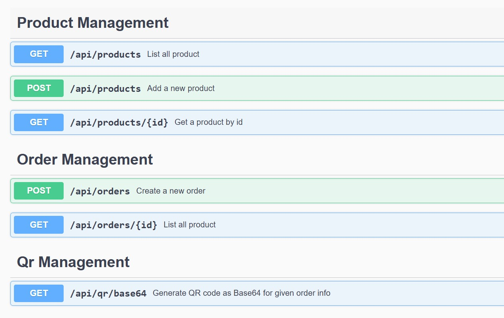

# mPOS_Order_Service
# 💳 mPOS Order Service Backend

A simple and robust backend for a Mobile Point-of-Sale (mPOS) system built using Java and Spring Boot. This service handles **product management**, **order creation**, and **QR code generation** for order confirmation.

---

## 📌 Features

### ✅ Product Management
- Add new products
- Fetch all products
- Get product by ID

### ✅ Order Management
- Create a new order
- Stock validation and deduction
- Generate unique order ID
- Return order summary with product details
- List all orders

### ✅ QR Code Generation
- Generate a QR code with:
  - Order ID
  - Total amount
  - Customer name
- Return as Base64 string and downloadable image

### 🧪 Bonus Features (Optional)
- H2 In-Memory Database
- Swagger API Docs

---

## 🛠 Tech Stack

- Java 17
- Spring Boot
- Spring Data JPA
- H2 Database
- Lombok
- Swagger (Springdoc OpenAPI)
- ZXing (QR Code generation)
- Maven


## 📸 Swagger UI Screenshot

You can view the Swagger UI screenshot here:



---
🔹 Product Management Endpoints
-------------------------------------
POST   /products           - Add a new product  
GET    /products           - List all products  
GET    /products/{id}      - Get product by ID  

🔹 Order Management Endpoints
-------------------------------------
POST   /orders             - Create a new order  
GET    /orders             - List all orders  

🔹 QR Code Generation Endpoints
-------------------------------------
GET    /qr/{orderId}              - Get QR code as Base64 string  
GET    /qr/download/{orderId}     - Download QR code image (PNG)

## ⚙️ How to Run

### 1. Clone the Repository
```bash
git clone https://github.com/your-username/mpost-order-service.git
cd mpost-order-service
